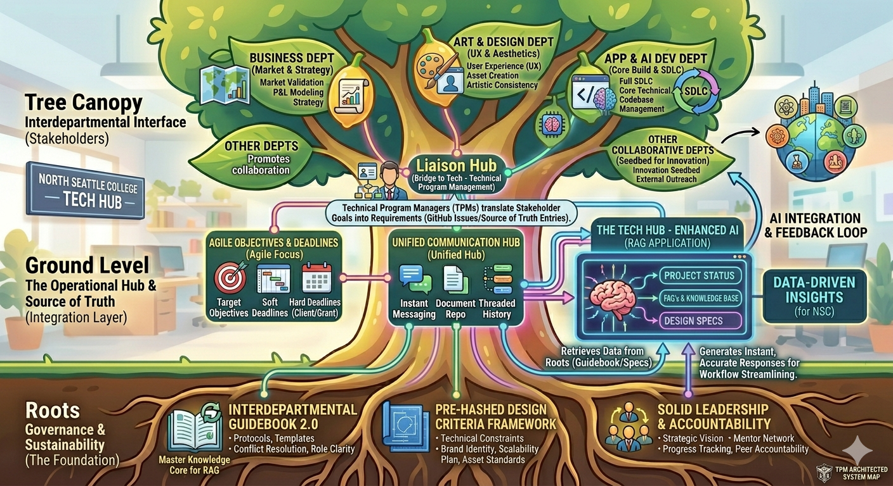

# NSC Tech Hub

### The Technical Engine for Bridge to Tech
The NSC Tech Hub is an interdepartmental agency at North Seattle College designed to bridge the gap between Creative, Business, and Technical disciplines. We provide the infrastructure, governance, and technical program management required to scale student-led projects into professional institutional assets.

## 🏛 The Architecture (The Tree Model)

Our operations are modeled after a tree to ensure both stability and growth:
* **The Roots (Governance):** Our "Source of Truth" documentation and RAG-indexed guidebooks.
* **The Trunk (TPM):** Technical Program Management that translates stakeholder needs into execution.
* **The Canopy (Stakeholders):** Cross-departmental collaboration between App Dev, Art, and Business.

## 🛠 Active Stage: 1.1 Live Integration
We are currently in the process of codifying our manual protocols into an automated "Source of Truth."
* **Primary Goal:** Transitioning from person-dependent to system-dependent workflows.
* **Current Infrastructure:** Centralized GitHub Organization and standardized "Liaison Nodes."

## 👥 Roles & Teams
* **Admins:** Faculty and TPM Oversight.
* **Liaison Nodes:** Department leads managing cross-functional communication.
* **Production Teams:** AD Students, Designers, and Business Analysts.

---
*For internal protocols and "The Roots," please refer to the `documentation` repository.*
